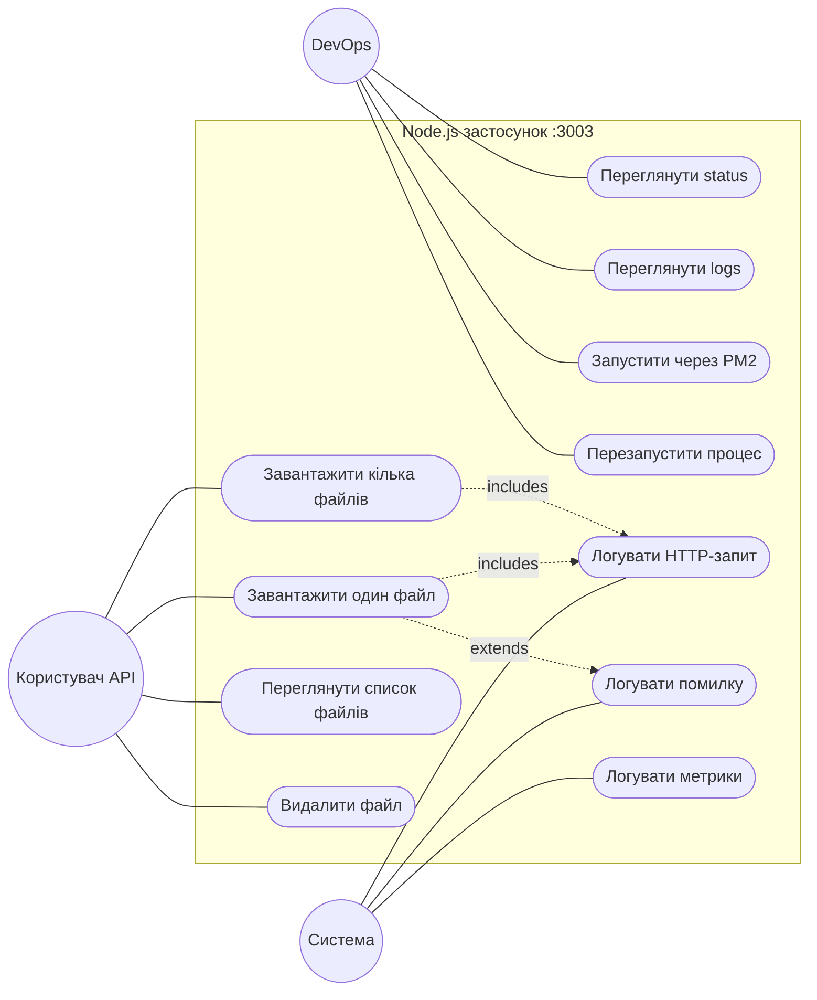
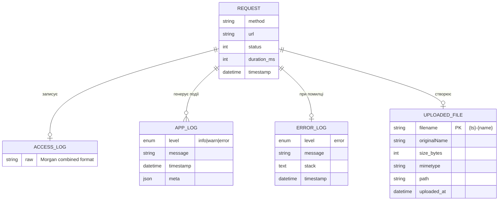
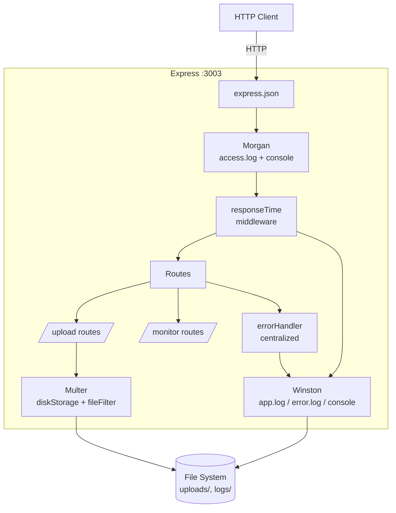
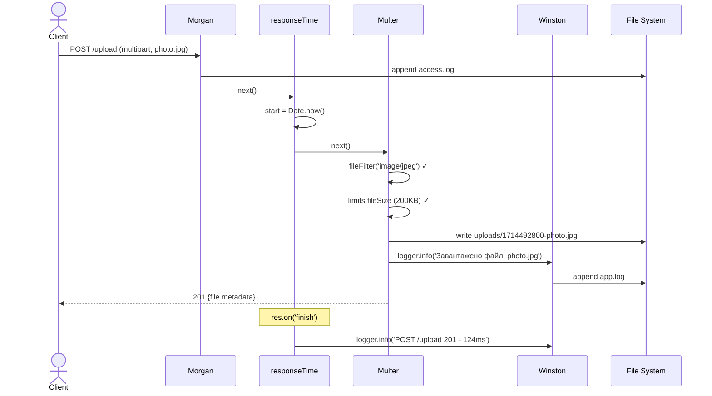
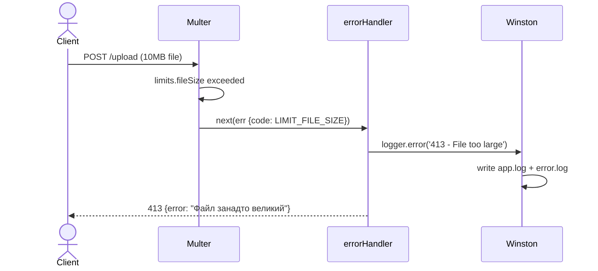
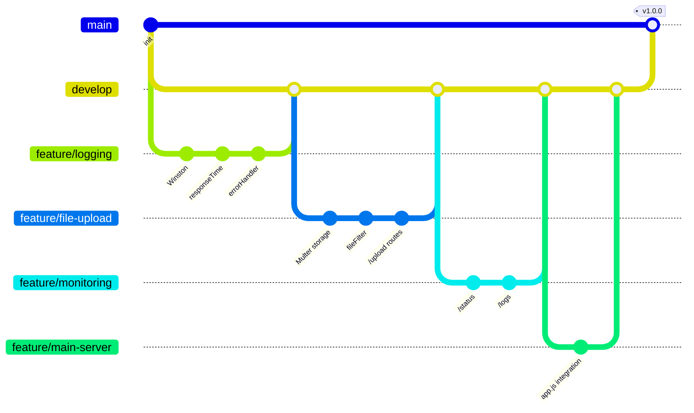

# Лабораторна робота №4

**Тема:** Розширені можливості Node.js-додатків: логування, завантаження файлів, моніторинг продуктивності.

**Дисципліна:** WEB-орієнтовані технології. Backend розробки

**Виконав:** студент групи ІО-31 Сас Євгеній Олександрович
**Перевірила:** Світлана Леонідівна Проскура

КПІ ім. Ігоря Сікорського, ФІОТ, кафедра ІСТ — Київ, 2026

---

## Зміст

1. [Мета роботи](#1-мета-роботи)
2. [Опис предметної області та бізнес-логіка](#2-опис-предметної-області-та-бізнес-логіка)
3. [Функціональні вимоги](#3-функціональні-вимоги)
4. [Нефункціональні вимоги](#4-нефункціональні-вимоги)
5. [Use Case діаграма](#5-use-case-діаграма)
6. [ER-діаграма](#6-er-діаграма)
7. [Архітектура застосунку](#7-архітектура-застосунку)
8. [Теоретичні основи](#8-теоретичні-основи)
9. [Реалізація](#9-реалізація)
10. [Sequence-діаграми ключових сценаріїв](#10-sequence-діаграми-ключових-сценаріїв)
11. [Тестування](#11-тестування)
12. [Версійний контроль Git](#12-версійний-контроль-git)
13. [Висновки](#13-висновки)
14. [Список використаних джерел](#14-список-використаних-джерел)

---

## 1. Мета роботи

Освоїти розширені можливості серверних застосунків на базі Node.js:

- Реалізувати **дворівневе логування** (Morgan для HTTP + Winston для подій);
- Налаштувати **прийом файлів** через Multer із валідацією типу та розміру;
- Реалізувати **моніторинг продуктивності** (uptime, memory, CPU);
- Створити централізований **error handler** з логуванням помилок;
- Запустити застосунок через **PM2** з автоматичним перезапуском.

---

## 2. Опис предметної області та бізнес-логіка

### 2.1 Контекст

DevCourses — освітня платформа, де користувачі завантажують аватарки, домашні завдання у форматі PDF, скриншоти. У production важливо:

1. Знати, **що саме** робить кожен користувач (аудит запитів);
2. Швидко **знаходити помилки** (структурований error log);
3. Контролювати **навантаження** (memory leaks, CPU, uptime);
4. Безпечно приймати файли (без OOM-атак через великі файли).

### 2.2 Стейкхолдери

| Роль | Інтерес |
|------|---------|
| **DevOps** | Доступ до логів, перезапуск процесу при крашах |
| **Backend-розробник** | Структуровані логи помилок із timestamp |
| **Системний адміністратор** | Метрики стану сервера в реальному часі |
| **Користувач** | Можливість завантажити файл без обмежень UX |

### 2.3 Бізнес-правила

- **БР-1.** Усі HTTP-запити логуються в `logs/access.log` (формат combined).
- **БР-2.** Усі події рівня `info+` логуються в `logs/app.log` у JSON-форматі.
- **БР-3.** Помилки рівня `error` дублюються в `logs/error.log`.
- **БР-4.** Файли ≤ **5 МБ**, типи: `image/jpeg`, `image/png`, `application/pdf`.
- **БР-5.** Максимум **5 файлів** за один запит `/upload-multiple`.
- **БР-6.** Ім'я збереженого файлу: `{timestamp}-{originalName}` — для уникнення колізій.
- **БР-7.** Завантажений файл доступний публічно через `/uploads/:filename`.
- **БР-8.** Кожні 30 секунд у лог пишуться метрики процесу (heap, CPU, uptime).

### 2.4 Бізнес-процеси

**БП-1. Завантаження файлу**

```
1. Клієнт надсилає POST /upload з multipart/form-data
2. Morgan записує запит у access.log
3. responseTime middleware засікає start = Date.now()
4. Multer:
   ├─ fileFilter перевіряє MIME-тип
   │    ❌ → next(err) → errorHandler → 400
   ├─ limits.fileSize перевіряє розмір
   │    ❌ → 413 LIMIT_FILE_SIZE
   └─ ✅ зберігає файл у uploads/{timestamp}-{name}
5. Winston: logger.info('Завантажено файл: ...')
6. Відповідь 201 + метадані файлу
7. responseTime: logger.info('POST /upload 201 - 124ms')
```

**БП-2. Моніторинг стану**

```
1. Клієнт: GET /status
2. Сервер збирає метрики:
   - process.uptime() → секунди роботи
   - process.memoryUsage() → heap, rss, external
   - process.cpuUsage() → user/system μs
3. Форматує у людиночитабельний вигляд
4. Логує: logger.info('Status check — uptime: 5хв, heap: 23.4 МБ')
5. Відповідь JSON
```

---

## 3. Функціональні вимоги

| ID | Назва | Опис | Пріоритет |
|----|-------|------|-----------|
| **FR-001** | Логування HTTP-запитів | Morgan combined → access.log + dev → консоль | High |
| **FR-002** | Файлове логування подій | Winston: app.log (info+), error.log (error) | High |
| **FR-003** | Кольорове логування у консоль | Winston з форматом colorize | Medium |
| **FR-004** | Вимірювання часу відповіді | Middleware: res.on('finish') → log duration | High |
| **FR-005** | Централізована обробка помилок | Express err handler → 4xx/5xx + Winston | High |
| **FR-006** | Завантаження одного файлу | POST /upload (поле `file`) | High |
| **FR-007** | Завантаження кількох файлів | POST /upload-multiple (до 5 файлів) | High |
| **FR-008** | Валідація типу файлу | jpg, png, pdf — інакше 400 | High |
| **FR-009** | Валідація розміру файлу | Максимум 5 МБ — інакше 413 | High |
| **FR-010** | Список завантажених файлів | GET /files | Medium |
| **FR-011** | Видалення файлу | DELETE /files/:filename | Medium |
| **FR-012** | Endpoint /status | uptime, memory, CPU, PID | High |
| **FR-013** | Endpoint /logs | Останні 50 записів app.log | Medium |
| **FR-014** | Запуск через PM2 | Автоперезапуск, моніторинг | Medium |
| **FR-015** | Періодичне логування метрик | Кожні 30с — heap, CPU, uptime | Low |

---

## 4. Нефункціональні вимоги

| ID | Категорія | Вимога |
|----|-----------|--------|
| **NFR-001** | Продуктивність | Логування не повинно впливати на час відповіді (> 5%) |
| **NFR-002** | Безпека | Файли валідуються до збереження (fileFilter) |
| **NFR-003** | Безпека | Імена файлів санітайзяться (`replace(/\s+/g, '_')`) |
| **NFR-004** | Стабільність | PM2 перезапускає процес при краші |
| **NFR-005** | Підтримуваність | Логи у JSON — придатні для ELK/Datadog |
| **NFR-006** | Дисковий простір | Ротація логів (за бажанням — winston-daily-rotate-file) |
| **NFR-007** | Спостережуваність | /status повертає всі метрики потрібні для health-check |
| **NFR-008** | Масштабованість | Stateless архітектура — можна запустити декілька інстансів |

---

## 5. Use Case діаграма



---

## 6. ER-діаграма



> Дані не зберігаються в SQL — це **файлова система** та потоки логів. ER-діаграма показує концептуальні зв'язки для розуміння потоків даних.

---

## 7. Архітектура застосунку



### Структура проєкту

```
lab4/
├── app.js                           # Головний сервер
├── config/
│   └── logger.js                    # Winston (3 транспорти)
├── middleware/
│   ├── responseTime.js              # Вимір часу відповіді
│   └── errorHandler.js              # Глобальна обробка помилок
├── routes/
│   ├── upload.js                    # POST /upload, /upload-multiple
│   └── monitor.js                   # GET /status, /logs
├── uploads/                         # Завантажені файли
├── logs/
│   ├── app.log                      # Усі події (JSON)
│   ├── error.log                    # Тільки помилки
│   └── access.log                   # Morgan combined
├── package.json
└── README.md
```

---

## 8. Теоретичні основи

### 8.1 Логування: рівні та призначення

| Рівень | Призначення | Приклад |
|--------|-------------|---------|
| `debug` | Деталі для розробника | "Cache hit for key X" |
| `info` | Звичайні події | "Server started on port 3003" |
| `warn` | Підозріле, але не критичне | "Slow query: 1.2s" |
| `error` | Помилки, що потребують уваги | "Database connection lost" |

### 8.2 Morgan: HTTP-логер

Morgan — middleware, що логує **кожен** HTTP-запит. Формати:

| Формат | Приклад виводу |
|--------|----------------|
| `tiny` | `GET / 200 12 - 5ms` |
| `dev` | `GET / 200 5ms - 12` (з кольорами) |
| `combined` | `127.0.0.1 - - [29/Apr/2026:10:00:00 +0300] "GET / HTTP/1.1" 200 12 "-" "Mozilla/5.0..."` |

**Combined** — Apache-стандарт, придатний для аналізу через `awk`, GoAccess, AWStats.

### 8.3 Winston: гнучке логування

Winston підтримує **транспорти** (куди писати) та **формати** (як писати):

```js
new winston.transports.File({ filename: 'app.log', level: 'info' });
new winston.transports.Console({ format: winston.format.colorize() });
new winston.transports.Http({ host: 'logs.example.com' });
```

**JSON-формат** ідеально парситься у системах аналізу логів (ELK Stack, Datadog, CloudWatch).

### 8.4 Multer: multipart/form-data

Браузер відправляє файли у форматі `multipart/form-data` — це не JSON, а **багатопротокольне тіло** з межами:

```
------WebKitFormBoundary7MA4YWxkTrZu0gW
Content-Disposition: form-data; name="file"; filename="photo.jpg"
Content-Type: image/jpeg

<binary data>
------WebKitFormBoundary7MA4YWxkTrZu0gW--
```

Multer:
1. Парсить multipart-тіло;
2. Викликає `fileFilter(req, file, cb)` для валідації;
3. Якщо `cb(null, true)` → зберігає файл за `storage`;
4. Заповнює `req.file` (single) або `req.files` (array).

### 8.5 Метрики Node.js process

| Метод | Повертає | Одиниці |
|-------|----------|---------|
| `process.uptime()` | Час роботи процесу | секунди |
| `process.memoryUsage()` | `{ rss, heapTotal, heapUsed, external }` | байти |
| `process.cpuUsage()` | `{ user, system }` | мікросекунди |
| `process.pid` | ID процесу | число |
| `process.version` | Версія Node | string `"v22.15.0"` |

**Терміни:**
- **Heap** — пам'ять, де живуть JS-об'єкти. `heapUsed` росте → потенційний memory leak.
- **RSS** (Resident Set Size) — уся пам'ять процесу включно з C++ нативними модулями.
- **External** — пам'ять, виділена для буферів зовні V8 (наприклад, Buffer'и).

### 8.6 PM2: менеджер процесів

PM2 запускає Node-застосунок як **демон** із додатковими можливостями:

```bash
pm2 start app.js --name myapp     # запуск
pm2 list                           # список усіх процесів
pm2 monit                          # інтерактивна панель CPU/RAM
pm2 logs myapp                     # потік логів
pm2 restart myapp                  # рестарт без даунтайму (cluster mode)
pm2 stop myapp                     # зупинка
pm2 startup                        # автозапуск при старті ОС
pm2 save                           # збереження поточного списку
```

**Cluster mode** (`pm2 start app.js -i max`) — запускає N інстансів за кількістю CPU-ядер, навантаження розподіляється Round-Robin.

---

## 9. Реалізація

### 9.1 Winston-логер (`config/logger.js`)

```js
const winston = require('winston');
const path    = require('path');

const logDir = path.join(__dirname, '..', 'logs');

const logger = winston.createLogger({
  level: 'info',
  format: winston.format.combine(
    winston.format.timestamp({ format: 'YYYY-MM-DD HH:mm:ss' }),
    winston.format.errors({ stack: true }),
    winston.format.json(),
  ),
  transports: [
    new winston.transports.File({ filename: path.join(logDir, 'app.log'),    level: 'info'  }),
    new winston.transports.File({ filename: path.join(logDir, 'error.log'),  level: 'error' }),
    new winston.transports.Console({
      format: winston.format.combine(
        winston.format.colorize(),
        winston.format.printf(({ level, message, timestamp }) =>
          `[${timestamp}] ${level}: ${message}`),
      ),
    }),
  ],
});

module.exports = logger;
```

### 9.2 Response Time middleware (`middleware/responseTime.js`)

```js
const logger = require('../config/logger');

module.exports = (req, res, next) => {
  const start = Date.now();
  res.on('finish', () => {
    const duration = Date.now() - start;
    const level = res.statusCode >= 400 ? 'warn' : 'info';
    logger[level](`${req.method} ${req.originalUrl} ${res.statusCode} - ${duration}ms`);
  });
  next();
};
```

**Як працює:** `res.on('finish')` викликається після того, як Express відправив відповідь. Завдяки цьому ми знаємо `res.statusCode` та можемо точно виміряти `duration`.

### 9.3 Error Handler (`middleware/errorHandler.js`)

```js
const logger = require('../config/logger');

module.exports = (err, req, res, next) => {
  logger.error(`${err.status || 500} - ${err.message} - ${req.originalUrl} - ${req.method}`);

  if (err.code === 'LIMIT_FILE_SIZE')
    return res.status(413).json({ error: 'Файл занадто великий. Максимум: 5 МБ' });

  if (err.code === 'LIMIT_FILE_COUNT')
    return res.status(400).json({ error: 'Перевищено максимальну кількість файлів (5)' });

  if (err.message === 'INVALID_FILE_TYPE')
    return res.status(400).json({ error: 'Дозволені формати: JPG, PNG, PDF' });

  res.status(err.status || 500).json({
    error: err.message || 'Внутрішня помилка сервера',
  });
};
```

### 9.4 Multer + маршрути файлів (`routes/upload.js`)

```js
const express = require('express');
const multer  = require('multer');
const path    = require('path');
const fs      = require('fs');
const logger  = require('../config/logger');

const router = express.Router();

const ALLOWED = ['image/jpeg', 'image/png', 'application/pdf'];
const MAX_SIZE = 5 * 1024 * 1024;

const fileFilter = (req, file, cb) => {
  if (ALLOWED.includes(file.mimetype)) cb(null, true);
  else { const e = new Error('INVALID_FILE_TYPE'); e.code = 'INVALID_FILE_TYPE'; cb(e, false); }
};

const storage = multer.diskStorage({
  destination: (req, file, cb) => {
    const dir = path.join(__dirname, '..', 'uploads');
    if (!fs.existsSync(dir)) fs.mkdirSync(dir, { recursive: true });
    cb(null, dir);
  },
  filename: (req, file, cb) => {
    const ext = path.extname(file.originalname);
    const name = path.basename(file.originalname, ext).replace(/\s+/g, '_');
    cb(null, `${Date.now()}-${name}${ext}`);
  },
});

const upload = multer({ storage, fileFilter, limits: { fileSize: MAX_SIZE, files: 5 } });

// ── Один файл ────────────────────────────────────────────────────────
router.post('/upload', upload.single('file'), (req, res) => {
  if (!req.file) return res.status(400).json({ error: 'Файл не надано' });
  logger.info(`Завантажено файл: ${req.file.originalname} (${req.file.size}B)`);
  res.status(201).json({ message: 'OK', file: req.file });
});

// ── Кілька файлів ────────────────────────────────────────────────────
router.post('/upload-multiple', upload.array('files', 5), (req, res) => {
  if (!req.files?.length) return res.status(400).json({ error: 'Файли не надані' });
  logger.info(`Завантажено ${req.files.length} файл(ів)`);
  res.status(201).json({ count: req.files.length, files: req.files });
});

// ── Список ───────────────────────────────────────────────────────────
router.get('/files', (req, res) => {
  const dir = path.join(__dirname, '..', 'uploads');
  const files = fs.existsSync(dir) ? fs.readdirSync(dir) : [];
  res.json({ count: files.length, files });
});

// ── Видалення ────────────────────────────────────────────────────────
router.delete('/files/:filename', (req, res) => {
  const fp = path.join(__dirname, '..', 'uploads', req.params.filename);
  if (!fs.existsSync(fp)) return res.status(404).json({ error: 'Файл не знайдено' });
  fs.unlinkSync(fp);
  logger.info(`Видалено файл: ${req.params.filename}`);
  res.json({ message: 'Видалено' });
});

module.exports = router;
```

### 9.5 Моніторинг (`routes/monitor.js`)

```js
router.get('/status', (req, res) => {
  const m = process.memoryUsage();
  const c = process.cpuUsage();
  const u = process.uptime();

  res.json({
    status: 'running',
    uptime: `${Math.floor(u / 60)}хв ${Math.floor(u % 60)}с`,
    memory: {
      heapUsed:  `${(m.heapUsed  / 1024 / 1024).toFixed(2)} МБ`,
      heapTotal: `${(m.heapTotal / 1024 / 1024).toFixed(2)} МБ`,
      rss:       `${(m.rss       / 1024 / 1024).toFixed(2)} МБ`,
    },
    cpu: { user: c.user, system: c.system },
    nodeVersion: process.version,
    pid: process.pid,
    timestamp: new Date().toISOString(),
  });
});
```

### 9.6 Збірка в `app.js`

```js
const express = require('express');
const morgan  = require('morgan');
const fs      = require('fs');
const path    = require('path');

const logger        = require('./config/logger');
const responseTime  = require('./middleware/responseTime');
const errorHandler  = require('./middleware/errorHandler');
const uploadRoutes  = require('./routes/upload');
const monitorRoutes = require('./routes/monitor');

const app = express();

app.use(express.json());
app.use('/uploads', express.static(path.join(__dirname, 'uploads')));

// Morgan: у файл (combined) + у консоль (dev)
const accessLog = fs.createWriteStream(path.join(__dirname, 'logs', 'access.log'), { flags: 'a' });
app.use(morgan('combined', { stream: accessLog }));
app.use(morgan('dev'));

// Власний middleware вимірювання часу
app.use(responseTime);

app.use('/', uploadRoutes);
app.use('/', monitorRoutes);

app.use((req, res) => res.status(404).json({ error: 'Маршрут не знайдено' }));
app.use(errorHandler);

const PORT = 3003;
app.listen(PORT, () => {
  logger.info(`Server started on port ${PORT}`);

  // Періодичне логування метрик
  setInterval(() => {
    const m = process.memoryUsage();
    logger.info(`[monitor] heap: ${(m.heapUsed/1024/1024).toFixed(2)} MB | uptime: ${Math.floor(process.uptime())}s`);
  }, 30_000);
});
```

---

## 10. Sequence-діаграми ключових сценаріїв

### 10.1 Завантаження файлу



### 10.2 Обробка помилки (файл занадто великий)



---

## 11. Тестування

### 11.1 Усі ендпоінти

| Метод | URL | Опис | Успіх | Помилки |
|-------|-----|------|-------|---------|
| GET | `/` | Список ендпоінтів | 200 | — |
| GET | `/status` | Метрики сервера | 200 | — |
| GET | `/logs` | Останні 50 записів app.log | 200 | — |
| POST | `/upload` | Один файл (поле `file`) | 201 | 400/413 |
| POST | `/upload-multiple` | До 5 файлів (поле `files`) | 201 | 400/413 |
| GET | `/files` | Список завантажених | 200 | — |
| DELETE | `/files/:name` | Видалити файл | 200 | 404 |

### 11.2 Тестування файлового завантаження

```bash
# 1. Успіх — JPG 200KB
curl -X POST http://localhost:3003/upload -F "file=@photo.jpg"
# → 201 {file metadata}

# 2. Помилка — TXT (не у списку дозволених)
curl -X POST http://localhost:3003/upload -F "file=@notes.txt"
# → 400 {"error":"Дозволені формати: JPG, PNG, PDF"}

# 3. Помилка — файл > 5MB
curl -X POST http://localhost:3003/upload -F "file=@large.pdf"
# → 413 {"error":"Файл занадто великий. Максимум: 5 МБ"}

# 4. Кілька файлів
curl -X POST http://localhost:3003/upload-multiple \
  -F "files=@a.jpg" -F "files=@b.png" -F "files=@c.pdf"
# → 201 {count: 3, files: [...]}

# 5. Перевищення кількості
curl -X POST http://localhost:3003/upload-multiple \
  -F "files=@a.jpg" -F "files=@b.jpg" -F "files=@c.jpg" \
  -F "files=@d.jpg" -F "files=@e.jpg" -F "files=@f.jpg"
# → 400 LIMIT_FILE_COUNT
```

### 11.3 Моніторинг

```bash
# Стан сервера
curl http://localhost:3003/status | jq
```

Приклад відповіді:
```json
{
  "status": "running",
  "uptime": "12хв 34с",
  "memory": {
    "heapUsed":  "23.45 МБ",
    "heapTotal": "32.12 МБ",
    "rss":       "78.90 МБ"
  },
  "cpu": { "user": 1234567, "system": 456789 },
  "nodeVersion": "v22.15.0",
  "pid": 14020,
  "timestamp": "2026-04-30T02:50:25.123Z"
}
```

### 11.4 Перевірка логів

```bash
# Останні рядки HTTP-запитів
tail -n 5 logs/access.log

# Останні події (JSON)
tail -n 5 logs/app.log | jq

# Тільки помилки
cat logs/error.log | jq
```

Приклад `app.log`:
```json
{"level":"info","message":"Server started on port 3003","timestamp":"2026-04-30 02:50:25"}
{"level":"info","message":"POST /upload 201 - 124ms","timestamp":"2026-04-30 02:51:02"}
{"level":"warn","message":"POST /upload 413 - 8ms","timestamp":"2026-04-30 02:52:15"}
```

### 11.5 Запуск через PM2

```bash
# Встановлення
npm install -g pm2

# Запуск
pm2 start app.js --name devcourses-lab4

# Моніторинг
pm2 list
# ┌─────┬───────────────────┬─────────┬──────┬───────┬──────────┬──────────┐
# │ id  │ name              │ status  │ cpu  │ mem   │ uptime   │ restarts │
# ├─────┼───────────────────┼─────────┼──────┼───────┼──────────┼──────────┤
# │ 0   │ devcourses-lab4   │ online  │ 0%   │ 65MB  │ 5m       │ 0        │
# └─────┴───────────────────┴─────────┴──────┴───────┴──────────┴──────────┘

pm2 monit              # інтерактивна панель
pm2 logs devcourses-lab4

# Тест автоматичного перезапуску — kill процес
kill -9 <pid>
pm2 list   # restarts: 1, status: online ← PM2 автоматично перезапустив
```

---

## 12. Версійний контроль Git



| Гілка | Призначення |
|-------|-------------|
| `feature/logging` | Winston, Morgan, responseTime, errorHandler |
| `feature/file-upload` | Multer storage + fileFilter + маршрути |
| `feature/monitoring` | /status, /logs |
| `feature/main-server` | app.js — інтеграція всіх модулів |

**Репозиторій:** https://github.com/Freazg/devcourses4

---

## 13. Висновки

У результаті виконання лабораторної роботи №4 розроблено серверний застосунок із розширеними production-ready можливостями:

1. **Дворівневе логування:**
   - **Morgan** автоматично пише кожен HTTP-запит у `logs/access.log` (combined-формат для аналізу через GoAccess/AWStats);
   - **Winston** структуровано логує події у `logs/app.log` (JSON), помилки додатково у `logs/error.log`;
   - Кольоровий вивід у консоль із timestamp.
2. **Власний middleware `responseTime`** засікає тривалість обробки кожного запиту через `res.on('finish')` і пише результат у Winston із рівнем `info` (для 2xx/3xx) або `warn` (для 4xx/5xx).
3. **Централізована обробка помилок** (`errorHandler`) перехоплює усі помилки, логує через Winston і повертає коректні HTTP-коди (400/413/500) із зрозумілим JSON.
4. **Multer для файлів:**
   - `diskStorage` із кастомним іменем файлу `{timestamp}-{name}` (уникнення колізій);
   - `fileFilter` валідує MIME-тип (jpg/png/pdf) до запису на диск;
   - `limits.fileSize = 5 МБ`, `limits.files = 5` — захист від OOM;
   - `req.file` / `req.files` із метаданими.
5. **Endpoint `/status`** повертає uptime, heap, RSS, CPU, PID — придатний для health-check'ів у Kubernetes (liveness/readiness probes).
6. **Endpoint `/logs`** дає швидкий перегляд останніх 50 подій без SSH на сервер.
7. **Періодичне логування метрик** кожні 30с — корисно для виявлення memory leaks.
8. **PM2** забезпечує автоматичний перезапуск при краші, моніторинг через `pm2 monit`, можливість cluster mode.

Ця архітектура — **індустріальний стандарт** для production Node.js-застосунків. Структуровані JSON-логи легко інтегруються з ELK Stack, Datadog, AWS CloudWatch для централізованого аналізу.

---

## 14. Список використаних джерел

1. npm: morgan. — https://www.npmjs.com/package/morgan
2. Winston Documentation. — https://github.com/winstonjs/winston
3. Multer Documentation. — https://github.com/expressjs/multer
4. Node.js process API. — https://nodejs.org/api/process.html
5. PM2 Documentation. — https://pm2.keymetrics.io/docs/usage/quick-start
6. RFC 7578. **Returning Values from Forms: multipart/form-data.** — https://datatracker.ietf.org/doc/html/rfc7578
7. The Twelve-Factor App. **XI. Logs.** — https://12factor.net/logs
8. Express.js. **Error handling.** — https://expressjs.com/en/guide/error-handling.html
9. Mermaid.js. **Sequence diagrams.** — https://mermaid.js.org/syntax/sequenceDiagram.html
10. ДСТУ 3008:2015. Документація. Звіти у сфері науки і техніки.
